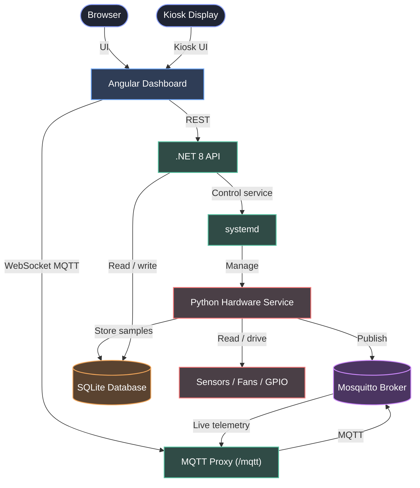
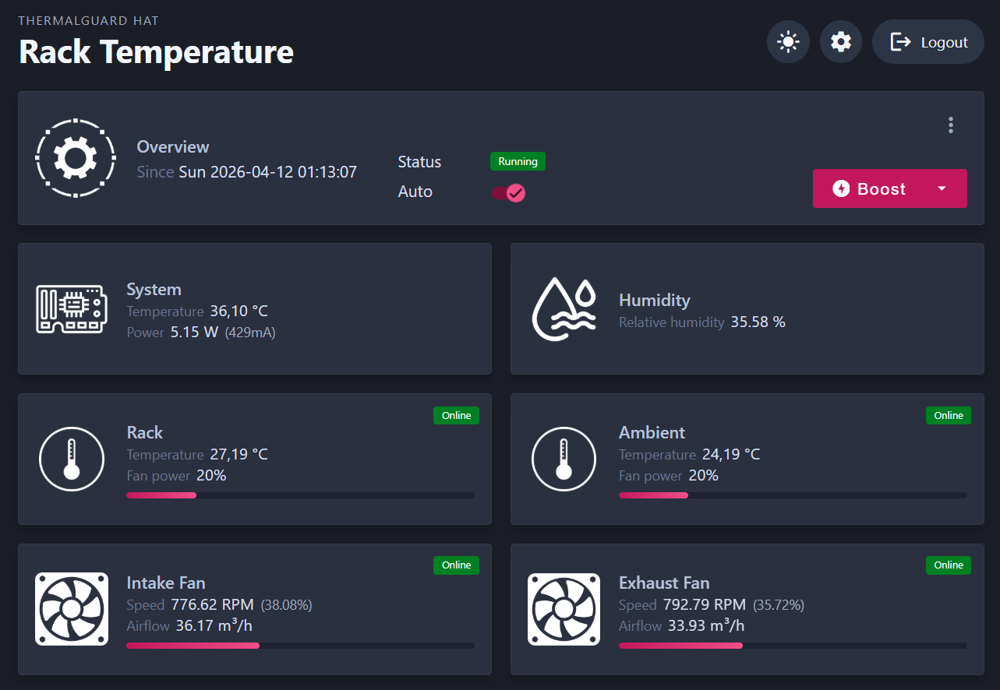

# ThermalGuard HAT

ThermalGuard HAT is a Raspberry Pi HAT for monitoring and controlling airflow in a server rack or enclosed equipment bay.

This repository contains both the hardware design and the software stack:

- a custom KiCad HAT
- a Python hardware service running on the Raspberry Pi
- a .NET 8 API
- an Angular web dashboard

## Demo

https://github.com/user-attachments/assets/547ba5f1-9dda-4290-b39c-db074ba426f6

## Board Renders And Wiring

### KiCad 3D render - front


### KiCad 3D render - back


### Wiring overview


## Features

- System monitoring for onboard temperature, power consumption and relative humidity
- Two configurable temperature probes for rack, ambient or custom placement
- Dual fan control with RPM tracking and airflow estimation
- Onboard display showing temperatures, fan RPM, IP address and MAC address
- Automatic fan curves with linked or independent behavior
- Temporary boost mode to force maximum cooling for a defined duration
- Audible alert when a fan or temperature probe is disconnected
- Onboard button control to mute or disable the audible alert
- Web dashboard with live status cards and historical charts
- History browsing by custom period, day or hour
- Local or remote access with authentication
- Kiosk mode for dedicated wall display or rack display usage
- End-to-end installation assistant, including kiosk setup
- Configurable SQLite storage location, including external USB or disk-based storage

The reference platform for this project is a Raspberry Pi 2B. The goal is also to make practical use of older Raspberry Pi hardware for a dedicated monitoring appliance, rather than requiring a newer and more expensive board.

## Repository Structure

```text
thermalguard-hat/
|-- backend/
|   |-- src/      .NET 8 API, persistence, workers, static frontend hosting
|   `-- tests/    .NET test project
|-- frontend/     Angular frontend
|-- services/     Raspberry Pi hardware service and Python tests
|-- kicad/        KiCad project for the HAT PCB
|-- config/       Shared example configuration
|-- docs/         README media assets
`-- install.sh    Raspberry Pi installation script
```

## Hardware

Main hardware blocks currently present in the project:

- Raspberry Pi 2B host
- custom HAT PCB designed in KiCad
- 2 x DS18B20 probes
- 1 x SHT31D temperature and humidity sensor
- 2 x PWM-controlled fans
- fan tachometer and current measurement circuitry
- OLED display and onboard controls

The repository is not only a software project. It also includes the PCB design files required to fabricate the HAT.

## Software Architecture



### Python service

The Python service is the hardware-facing part of the system. It:

- initializes GPIO and sensors
- controls the fans
- reads live measurements
- publishes telemetry on MQTT
- persists data into SQLite

Main entry points:

- [services/main.py](services/main.py)
- [services/service.py](services/service.py)

### Backend API

The backend is a .NET 8 application that:

- serves the web application
- exposes authenticated API endpoints
- stores and queries historical data
- exposes configuration for the frontend
- manages service status operations

Main entry points:

- [backend/src/NetApi/Program.cs](backend/src/NetApi/Program.cs)
- [backend/src/NetApi/Api/Controllers](backend/src/NetApi/Api/Controllers)

### Frontend

The frontend is an Angular application providing:

- dashboard views
- setup and login screens
- kiosk mode
- live MQTT-backed monitoring cards and graphs

Main entry points:

- [frontend/src/app/features/dashboard/pages/dashboard.component.ts](frontend/src/app/features/dashboard/pages/dashboard.component.ts)
- [frontend/src/app/core/app.routes.ts](frontend/src/app/core/app.routes.ts)

## Dashboard

The web interface provides both live monitoring cards and historical charts.

### Live overview



### History view


## Kiosk Mode

ThermalGuard HAT can run in kiosk mode for a dedicated rack display, with optional autologin, Chromium autostart, cursor hiding and screen blanking control.

https://github.com/user-attachments/assets/b98a219e-978e-4593-a772-88bbc4d270f7

## Installation

Run the installation script on the Raspberry Pi as root:

```bash
sudo bash -c "$(curl -sSL https://raw.githubusercontent.com/olivierpetitjean/thermalguard-hat/main/install.sh)"
```

The script installs the software stack, prepares the Raspberry Pi environment and deploys the backend, frontend and Python service.

## Storage Recommendation

For a permanent installation, it is strongly recommended to store the SQLite database on an external storage device such as:

- a USB flash drive
- an external SSD
- an external hard drive

Reason:

- the system performs repeated read and write operations
- keeping the database on the Raspberry Pi SD card increases wear
- the SD card also hosts the operating system, so avoiding unnecessary writes improves reliability

The database location is configurable through the shared connection string in [config/settings.example.json](config/settings.example.json).

## Configuration

The main configuration reference is [config/settings.example.json](config/settings.example.json).

The setup wizard intentionally hides a few advanced low-level values such as the GPIO chip index and PWM channel mapping. They remain available in the shared configuration file if manual tuning is ever needed.

The installation also runs an interactive configuration wizard. Its main sections are:

| Wizard section | What it configures |
|---|---|
| `API & Security` | CORS origin, JWT secret, token lifetime, retention policy and kiosk IP bypass rules |
| `Display & Naming` | Dashboard title, sensor names, fan names, locale, units and airflow display values |
| `Kiosk Mode` | Dedicated kiosk display behavior, local user, inline layout, cursor hiding, autologin, screen blanking and autostart |
| `MQTT Broker` | Local Mosquitto setup, WebSocket port, optional local authentication and optional MQTT bridge settings |
| `1-Wire Temperature Sensors` | Detection and assignment of the two DS18B20 probe identifiers |
| `Thresholds & Timing` | System fan threshold, database write interval, LCD screen standby delay, fan tach filter and PWM timing settings |

If kiosk mode is enabled, the installer then runs a second kiosk-specific step to apply the desktop autologin, screen blanking and Chromium autostart configuration.

### Core settings

| Key | Purpose | Example |
|---|---|---|
| `ConnectionStrings.WebApiDatabase` | Shared SQLite database path used by the API and Python service | `Data Source=/opt/thermalguard-hat/api/db/LocalDatabase.db` |
| `RetentionDays` | Number of days of historical data to keep | `30` |
| `Auth.JwtSecret` | Secret used to sign JWT tokens | `change-me-in-production-at-least-32-chars!!` |
| `Auth.TokenExpiryHours` | JWT validity duration in hours | `12` |
| `AllowedOrigins` | Allowed frontend origin for CORS | `http://raspberrypi.local` |

### MQTT and broker settings

| Key | Purpose | Example |
|---|---|---|
| `BrokerHostSettings.Host` | MQTT broker hostname or IP | `127.0.0.1` |
| `BrokerHostSettings.Port` | MQTT TCP port | `1883` |
| `BrokerHostSettings.WsPort` | MQTT over WebSocket port | `1884` |
| `BrokerHostSettings.User` | MQTT username | `your-user` |
| `BrokerHostSettings.Password` | MQTT password | `your-password` |
| `BrokerHostSettings.UseTls` | Enable TLS for broker communication | `false` |
| `Mosquitto.Local.Authentication.Enabled` | Enable authentication on local Mosquitto | `false` |
| `Mosquitto.Bridge.Enabled` | Enable broker bridge mode | `false` |
| `Mosquitto.Bridge.Host` | Upstream broker hostname | `mqtt.example.com` |
| `Mosquitto.Bridge.Port` | Upstream broker port | `1883` |

### Sensors, cooling and hardware pins

| Key | Purpose | Example |
|---|---|---|
| `Python.Sensor1Uid` | 1-Wire identifier for probe 1 | `xxxxxxxxxxxx` |
| `Python.Sensor2Uid` | 1-Wire identifier for probe 2 | `xxxxxxxxxxxx` |
| `Python.SysFanThreshold` | Temperature threshold for the system fan | `38` |
| `Python.Fan1Pin` | PWM pin for fan 1 | `12` |
| `Python.Fan2Pin` | PWM pin for fan 2 | `13` |
| `Python.Fan1Sensor` | Tachometer input for fan 1 | `25` |
| `Python.Fan2Sensor` | Tachometer input for fan 2 | `24` |
| `Python.SystemFan` | GPIO pin for the auxiliary system fan | `23` |
| `Python.SysBuzzer` | GPIO pin for the buzzer | `22` |
| `Python.Button1Pin` | GPIO pin for button 1 | `17` |
| `Python.Button2Pin` | GPIO pin for button 2 | `0` |

### Display and UI labels

| Key | Purpose | Example |
|---|---|---|
| `Display.DashboardTitle` | Dashboard title shown in the UI | `Dashboard` |
| `Display.Sensor1Name` | Label for probe 1 | `Rack` |
| `Display.Sensor2Name` | Label for probe 2 | `Ambient` |
| `Display.Fan1Name` | Label for fan 1 | `Intake Fan` |
| `Display.Fan2Name` | Label for fan 2 | `Exhaust Fan` |
| `Display.Locale` | UI locale | `en-US` |
| `Display.TemperatureUnit` | Temperature unit | `C` |
| `Display.AirflowUnit` | Airflow unit displayed in the UI | `m3h` |
| `Display.Fan1MaxAirflow` | Reference airflow value for fan 1 | `95.0` |
| `Display.Fan2MaxAirflow` | Reference airflow value for fan 2 | `95.0` |

### Kiosk settings

| Key | Purpose | Example |
|---|---|---|
| `Kiosk.BypassIPs` | IP addresses allowed to access kiosk mode without standard login | `[]` |
| `KioskSetup.Enabled` | Enable kiosk setup during installation | `false` |
| `KioskSetup.User` | Desktop user used for kiosk autologin | `pi` |
| `KioskSetup.HideCursor` | Hide mouse cursor in kiosk mode | `true` |
| `KioskSetup.DesktopAutologin` | Enable desktop autologin | `true` |
| `KioskSetup.DisableScreenBlanking` | Disable screen blanking and sleep | `true` |
| `KioskSetup.Autostart` | Launch kiosk automatically on boot | `true` |

## Security

- API endpoints are protected with JWT authentication except the authentication bootstrap endpoints
- passwords are hashed with BCrypt
- the JWT secret must be changed before deployment
- CORS origins should be restricted to the actual deployed frontend origin

## License

MIT. See [LICENSE](LICENSE).
